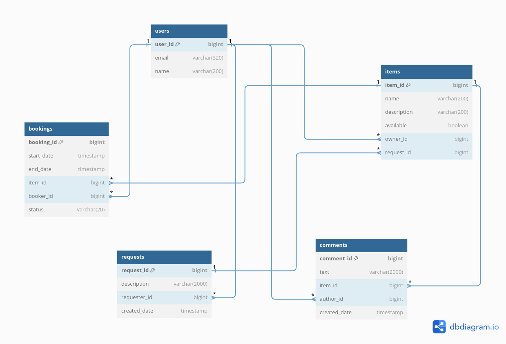

# Shareit

Cервис для шеринга (от англ. share — «делиться») вещей. 

Приложение даёт пользователям возможность:
- рассказать, какими вещами они готовы поделиться
- находить нужную вещь и брать её в аренду на какое-то время
- оставлять запросы, если нужной вещи на сервисе нет
- оставлять отзывы на вещь после того, как взяли её в аренду

## Database structure

